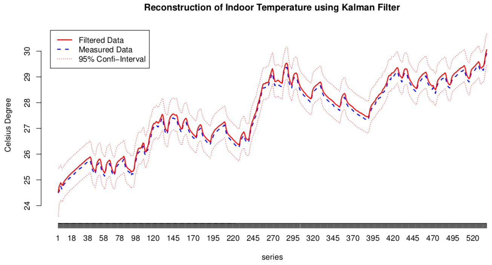
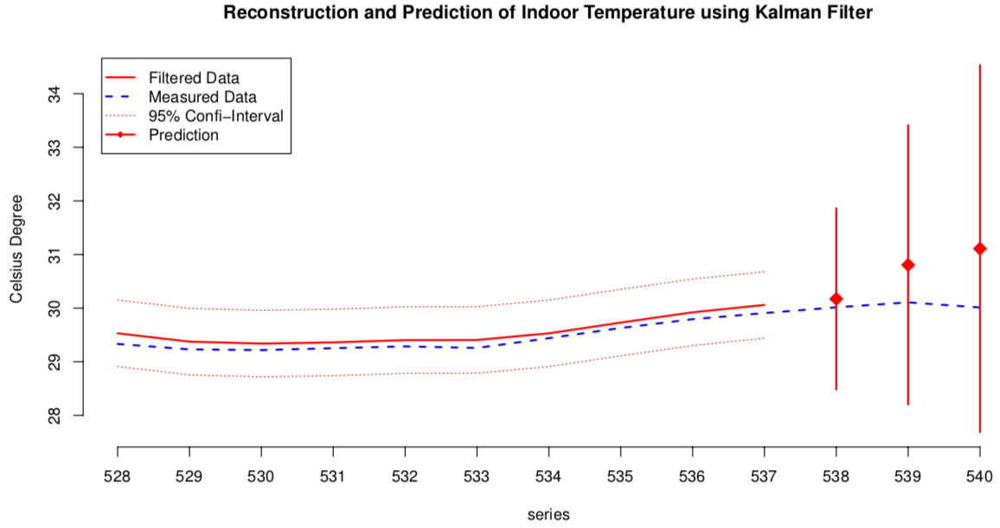

# Time Series Analysis for Energy

Explore Building Heat Dynamics using ARIMAX and State Space (Kalman Filter) Model

There is a building with floor heating. To keep the indoor temperature steady, the power of the floor heating will adjust automatically. The control strategy can be very simple, like to adjust according to current indoor temperature. However, this usually causes significant fluctuations. It's better to adjust according to the prediction. The heat feature of the building is a dynamical system, so one advanced regression model and three dynamical models are used to model and predict the heat dynamics.

Detailed explaination can be found in [edxu96/TSA-Energy/wiki](https://github.com/edxu96/TSA-Energy/wiki/1-Home).
