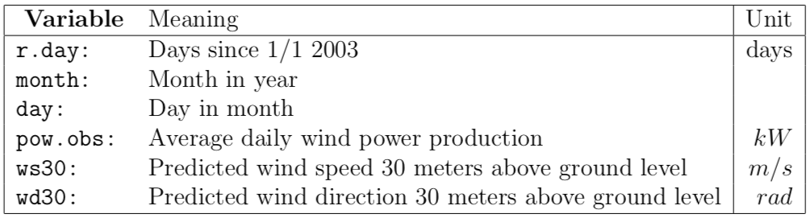

```{r, fig.width = 10}
# Clear variables
rm(list=ls())
library(knitr)
```

## Data Prepossessing

Input the dataWind of power production. The total dataWind set can be divided into three categories:

* 3 variables to describe the time (days since 1/1-2003, month, and day of month),
* 1 variable describing the observed output (power)
* 2 meteorological variable. 

The individual variables are described in Table 1.


```{r, fig.width = 10}
# Data Processing
dataWind <- read.table("tuno.dat")
r.day <- dataWind[ , 1]
month <- dataWind[ , 2]
day <- dataWind[ , 3]
power <- dataWind[ , 4] / 5000  # Normalize power output
windSpeed <- dataWind[ , 5]
windDirection <- dataWind[ , 6]
tuno <- data.frame(r.day, month, day, power, windSpeed, windDirection)
```

A wind power plant where all turbines stand still will actually have a negative production such numbers are set equal to zero in the original dataWind set. Hence the dataWind set consisted of numbers between 0 and 5,000 kW. Average daily values that are exactly zero are thought of as special phenomena where, for one reason or another the plant is down, these observations are removed from the dataWind set, which we will set as censored observation.

```{r, fig.width = 10}
r.day <- setdiff(seq(1, length(tuno$r.day)), tuno$r.day)
month <- rep(0, length(r.day))
day <- rep(0, length(r.day))
power <- rep(0, length(r.day))
windSpeed <- rep(0, length(r.day))
windDirection <- rep(0, length(r.day))
tuno.zero <- data.frame(r.day, month, day, power, windSpeed, windDirection)

tuno.all <- rbind(tuno, tuno.zero)
```

## Summary Statistics

```{r, fig.width = 10}
## Plot: Normalized Power Production in Tuno Farm with Censored Observation
plot(tuno.all[order(tuno.all$r.day), ]$r.day, tuno.all[order(tuno.all$r.day), ]$windSpeed, type = "l", col = "blue", main = "Normalized Power Production in Tuno Farm with Censored Observation", xlab = "day since 1 Jan 2003", ylab = "Normalized Power Production")
points(tuno.zero$r.day, tuno.zero$power, pch = 4, col = 2)
```

Besides plotting the power output as a function of time, there is no meaning to look into the censored data point in other analysis, because there is no corresponding measured values of wind speed and wind direction. So we just continue analysis without censored values.

```{r, fig.width = 10}
plot(tuno$windSpeed, tuno$power, main = "Normailized Power Production as a Function of Wind Speed in Tuno Farm", xlab = "Wind Speed (m/s)", ylab = "Normalized Power Production")
```

```{r, fig.width = 10}
plot(tuno$windDirection, tuno$power, main = "Normailized Power Production as a Function of Wind Direction in Tuno Farm", xlab = "Wind Direction (rad)", ylab = "Normalized Power Production")
```

```{r, fig.width = 10}
## Summary statistics by groups: Normailized Power Production as a Factor of Month in Tuno Farm
plot(factor(tuno$month), tuno$power, main = "Normailized Power Production as a Factor of Month in Tuno Farm", xlab = "Month", ylab = "Normalized Power Production")
```

We can't derive any conclusion from this boxplot.

## Simple Models of Wind Production

```{r, fig.width = 10}
hist(tuno$power, prob = TRUE, breaks = 50, main = "Histogram of Power Production in Tuno Farm", xlab = "Normalized Power Production", col = "gray90")
lines(density(tuno$power), lwd = 2, col = 4)
```

From the histogram, we can say there is no obvious distribution of the power output, but we can plot the usual distribution to compare.

Graphically, it seems there are two candidate probability distributions for the wind power, namely the gamma and the beta distribution respectively.

### Gamma Distribution of Power Production

```{r, fig.width = 10}
# Define function that return negative log-likelihood for gamma distribution
negaLogL_gamma <- function(pars, dataWind){
  alpha <- pars[1]
  theta <- pars[2]
  return (-sum(dgamma(x = dataWind, shape = alpha, scale = theta, log = TRUE)))
}

# Optimize alpha and theta parameters in gamma distribution for power production
pars_gammaD.optim_power <- optim(c(1, 1), fn = negaLogL_gamma, gr = NULL, dataWind = tuno$power)

# Plot optimized gamma distribution density and density of power production
density_power <- density(tuno$power, adjust = 0.7)
x_power = seq( 0, 1.2, length.out = 5000)  # To smooth the curve ??? 

alpha_gammaD.optim_power <- pars_gammaD.optim_power$par[1]
theta_gammaD.optim_power <- pars_gammaD.optim_power$par[2]
gammaD.optim_power = dgamma(x_power, shape = alpha_gammaD.optim_power, scale = theta_gammaD.optim_power)

## 
hist(tuno$power, breaks = 50, prob = TRUE, main = NULL, xlab = "Normalized Power Production (kW / 5000kW)", ylab = "Density", col = "gray95")
lines(density_power$x, density_power$y, type = 'l', xlim = c(0,1), ylim =c(0,3), col = 'blue', lwd = 2)
lines(x_power, gammaD.optim_power, xlim = c(0,1), col = 'red', lwd = 2, lty = 2)
title(main = "Gamma Distribution by MLE and Density of Power Production in Tuno Farm", font.main = 3)
legend("topright", inset = .02, legend = c("Gamma Distribution by MLE", "Density"), col = c("red", "blue"), lty = c(1, 2), lwd = c(2, 2), cex = 0.8)
```

## Beta Distribution of Power Production

```{r, fig.width = 10}
# Optimize alpha and beta parameters in beta distribution for power production
negaLogL_beta <- function(pars, dataWind){
    alpha <- pars[1]
    beta <- pars[2]
    return(- sum(dbeta(x = dataWind, shape1 = alpha, shape2 = beta, log = TRUE)))
}
pars_betaD.optim_power <- optim(c(1,1), fn = negaLogL_beta, gr = NULL, dataWind = tuno$power)

# Initialize optimized beta distribution density and density of power production
alpha_betaD.optim_power <- pars_betaD.optim_power$par[1]
beta_betaD.optim_power <- pars_betaD.optim_power$par[2]
betaD.optim_power <- dbeta(x_power, shape1 = alpha_betaD.optim_power, shape2 = beta_betaD.optim_power)

## Beta Distribution by MLE and Density of Power Production in Tuno Farm
hist(tuno$power, breaks = 50, prob = TRUE, main = NULL, xlab = "Normalized Power Production (kW / 5000kW)", ylab = "Density", col = "gray95")
lines(density_power$x, density_power$y, type = 'l', xlim = c(0,1), ylim =c(0,3), col = 'blue', lwd = 2)
lines(x_power, betaD.optim_power, xlim = c(0,1), col = 'red', lwd = 2, lty = 2)
title(main = "Beta Distribution by MLE and Density of Power Production in Tuno Farm", font.main = 3)
legend("topright", inset = .02, legend = c("Beta Distribution by MLE", "Density"), col=c("red", "blue"), lty = c(1, 2), lwd = c(2, 2), cex = 0.8)
```

## Akaike Information Criterion for Gamma and Beta Distribution

```{r, fig.width = 10}
logLikelihood_gammaD.optim_power <- - negaLogL_gamma(c(alpha_gammaD.optim_power, theta_gammaD.optim_power), tuno$power)
aic_gammaD.optim_power <- - 2 * logLikelihood_gammaD.optim_power + 2 * 2
logLikelihood_betaD.optim_power <- - negaLogL_beta(c(alpha_betaD.optim_power, beta_betaD.optim_power), tuno$power)
aic_betaD.optim_power <- - 2 * logLikelihood_betaD.optim_power + 2 * 2
aic_gammaD.optim_power
aic_betaD.optim_power
```

To make a decision between these two models, the AIC can be calculated from the formula.

As the AIC for the Beta-distribution is less than for the Gamma-distribution, it can be concluded that for the wind power variable, the Beta-distribution is the most appropriate model.

## Data Transformation for Normal Model of Wind Production

```{r, fig.width = 10}
qqnorm(tuno$power)
qqline(tuno$power)
```

## Transformation 1 of Wind Production

```{r, fig.width = 10}
trans_1 <- function(lambda, y){
    y.lambda <- 1 / lambda * log(y^lambda / (1 - y^lambda))
    return(y.lambda)
}

profileLogL_1 <- function(lambda, y){
    n <- length(y)
    y.lambda <- trans_1(lambda, y)
    mu <- 1 / n * sum(y.lambda)  # Mean of y.lambda
    sigma.square <- 1 / n * sum((y.lambda - mu)^2)
    y.lambda.partial <- y^(lambda - 1) / (1 - y^lambda) + 1 / y
    return(- n / 2 * log(sigma.square) - 1 / (2 * sigma.square) * sum((y.lambda - mu)^2) + sum(log(y.lambda.partial)))
}

lambda_1 <- seq(0.1, 0.5, by = 0.01)
profileLogL.1 <- sapply(lambda_1, profileLogL_1, y = tuno$power)
plot(lambda_1, profileLogL.1 - max(profileLogL.1), type = "l", ylab = "Log Likelihood")
lines(range(lambda_1),- qchisq(0.95, df = 1) / 2 * c(1,1), lty = 2, col = 2)
title("Profile Likelihood for Transformation 1 of Power Production")
profileLogL.1.optim <- optimize(profileLogL_1, c(0.1, 0.5), y = tuno$power, maximum = TRUE)
lambda_profileLogL.1.optim <- profileLogL.1.optim$maximum
```

```{r, fig.width = 10}
power.trans_1.optim <- trans_1(lambda_profileLogL.1.optim, tuno$power)
qqnorm(power.trans_1.optim, main = "QQ-plot of Power Production after Transformation 1")
qqline(power.trans_1.optim)
```

```{r, fig.width = 10}
hist(power.trans_1.optim, main = "Histogram of Power Production after MLE for Transformation 1", xlab = paste("Normalized power production when lambda = ", lambda_profileLogL.1.optim), ylab = "Density", col = "gray90")
```

## Transformation 2 of Wind Production

```{r, fig.width = 10}
trans_2 <- function(lambda, y){
    y.lambda <- 2 * log(y^lambda / (1 - y)^(1 - lambda))
    return(y.lambda)
}
profileLogL_2 <- function(lambda, y){
    n <- length(y)
    y.lambda <- trans_2(lambda, y)
    mu <- 1 / n * sum(y.lambda)  # Mean of y.lambda
    sigma.square <- 1 / n * sum((y.lambda - mu)^2)
    y.lambda.partial <- 2 * (lambda / y - (lambda - 1) / (1 - y))
    return(- n / 2 * log(sigma.square) - 1 / (2 * sigma.square) * sum((y.lambda - mu)^2) + sum(log(y.lambda.partial)))
}

lambda_2 <- seq(0, 1, by = 0.01)
profileLogL.2 <- sapply(lambda_2, profileLogL_2, y = tuno$power)
plot(lambda_2, profileLogL.2 - max(profileLogL.2), type = "l", ylab = "Log Likelihood", ylim = c(-100, 0))
lines(range(lambda_2),- qchisq(0.95, df = 1) / 2 * c(1,1), lty = 2, col = 2)
title("Profile Likelihood for Transformation 2 of Power Production")
profileLogL.2.optim <- optimize(profileLogL_2, c(0, 1), y = tuno$power, maximum = TRUE)
lambda_profileLogL.2.optim <- profileLogL.2.optim$maximum

```

```{r, fig.width = 10}
power.trans_2.optim <- trans_2(lambda_profileLogL.2.optim, tuno$power)
power.trans_2.optimMLE <- trans_2(0.2523298, tuno$power)
qqnorm(power.trans_2.optim, main = "QQ-plot of Power Production after Transformation 2")
qqline(power.trans_2.optim)
```

```{r, fig.width = 10}
hist(power.trans_2.optim, main = "Histogram of Power Production after MLE for Transformation 2", xlab = paste("Normalized power production when lambda = ", lambda_profileLogL.2.optim), ylab = "Density", col = "gray90")
```

## Cox-Box Transformation of Wind Production

```{r, fig.width = 10}
trans_boxCox <- function(lambda,y){
    y.lambda <- (y^lambda - 1) / lambda
    if(lambda == 0){
        y.lambda <- log(y)}
    return(y.lambda)
}

# Profile Log-Likelihood for Lambda
profileLogL_boxCox <- function(lambda,y){
    n <- length(y)
    y.lambda <- trans_boxCox(lambda, y)
    sigma.square <- 1 / n * sum((y.lambda - mean(y.lambda))^2)
    return(- n / 2 * log(sigma.square) - n / 2 + (lambda - 1) * sum(log(y)))
}

# Plot the profile likelihood
lambda_boxCox <- seq(0.2, 0.5, by = 0.01)
profileLogL.BoxCox <- sapply(lambda_boxCox, profileLogL_boxCox, y = tuno$power)
plot(lambda_boxCox, profileLogL.BoxCox - max(profileLogL.BoxCox), type = "l", ylab = "Log Likelihood")
lines(range(lambda_boxCox),- qchisq(0.95, df = 1) / 2 * c(1,1), lty = 2, col = 2)
title("Profile Likelihood for Box-Cox Transformation of Power Production")
profileLogL.boxCox.optim <- optimize(profileLogL_boxCox, c(0.2, 0.5), y = tuno$power, maximum = TRUE)
lambda_profileLogL.BoxCox.optim <- profileLogL.boxCox.optim$maximum
# so lambda in the range  to  (with 95% confidence)
```

```{r, fig.width = 10}
power.trans_boxCox.optim <- trans_boxCox(lambda_profileLogL.BoxCox.optim, tuno$power)
qqnorm(power.trans_boxCox.optim, main = "QQ-plot of Power Production after Box-Cox Transformation")
qqline(power.trans_boxCox.optim)
```

```{r, fig.width = 10}
hist(power.trans_boxCox.optim, main = "Histogram of Power Production after MLE for Box-Cox Transformation", xlab = paste("Normalized power production when lambda = ", lambda_profileLogL.BoxCox.optim), ylab = "Density", col = "gray90")
```

The result of the simple model is:

```{r, echo = FALSE}
numberTrans <- c('Tranformation_1', 'Tranformation_2', 'Box-Cox Tranformation')
lambda.MLE <- c(lambda_profileLogL.1.optim, lambda_profileLogL.2.optim, lambda_profileLogL.BoxCox.optim)
table_lambda.MLE <- data.frame(numberTrans, lambda.MLE)
kable(table_lambda.MLE, col.names = c('Transformation', 'MLE of lambda'), caption = 'MLE of lambda in transformation', align = "l")
```

# Regression Model

```{r, fig.width = 10, echo = FALSE}
y <- tuno$power
y.trans <- trans_1(lambda_profileLogL.1.optim, y)
x1 <- tuno$windSpeed
x1.square <- x1^2
x1.cubic <- x1^3
x2 <- tuno$windDirection
x2.square <- x2^2
n <- length(y.trans)
x1.pred <- seq(0, 30, 0.1)
# Transformed Normailized Power Production as a Function of Wind Speed in Tuno Farm
plot(x1, y.trans, main = "Transformed Normailized Power Production as a Function of Wind Speed", xlab = "Wind Speed (m/s)", ylab = "Transformed Normalized Power Production")
```

```{r, fig.width = 10, echo = FALSE}
plot(x2, y.trans, main = "Normailized Power Production as a Function of Wind Direction", xlab = "Wind Direction (rad)", ylab = "Normalized Power Production")
```

With two or more continuous explanatory variables (i.e. in a multiple regression; see p. 395) it is valuable to be able to check for subtle dependencies between the explanatory variables. The pairs function plots every variable in the dataframe on the y axis against every other variable on the x axis:

```{r, fig.width = 10}
# Scatterplot Matrices
pairs(cbind(y.trans, x1, x2), labels = c('power', 'windSpeed', 'windDirection'), panel = panel.smooth)
```

The response variables are named in the rows and the explanatory variables are named in the columns.

```{r, echo = FALSE}
# Function to plot the prediction result of regression model based on wind speed.
predictRegression.windSpeed <- function(x1.pred, x2, y, modelRegression){
    dataFramePredict <- data.frame(x1 = x1.pred, x2 = rep(mean(x2), length(x1.pred)))
    valuePred <- predict.lm(modelRegression, dataFramePredict, se.fit = TRUE)
    intervalPred <- predict.lm(modelRegression, newdata = dataFramePredict, interval = "pred", level = 0.95)
    intervalConf <- predict.lm(modelRegression, newdata = dataFramePredict, interval = "conf", level = 0.95)
    plot(dataFramePredict$x1, valuePred$fit, pch = 20, ylim = c(min(y, intervalPred), max(y, intervalPred)), xlim = c(min(x1, dataFramePredict$x1), max(x1, dataFramePredict$x1)), xlab = 'Wind Speed', ylab = 'Normalized Power Production')
    matlines(dataFramePredict$x1, intervalPred, lty = c(1, 2, 2), col = c("black", "blue", "blue"), lwd = 2)
    points(x1, y)  # Transformed observations
    lines(dataFramePredict$x1, intervalConf[, 2], lty = 3, col = "red", lwd = 2)
    lines(dataFramePredict$x1, intervalConf[, 3], lty = 3, col = "red", lwd = 2)
    legend("bottomright", inset = .02, legend = c("Regression Curve", "Prediction Interval", "Confidence Intercal"), col = c("black", "blue", "red"), lty = c(1, 2, 3), lwd = c(2, 2, 2), cex = 0.8)
}
```

## Regression Model 1: Multiple, y.trans ~ x1, x1^2, x1^3, x2

The initial model is based on the dataWind that has not been transformed and will therefore be a non-normal model. A rather complex structure is initially chosen since that will allow us to either iteratively remove non-significant parameters or expand our model if it is necessary.

```{r, fig.width = 10, include = FALSE}
## Hand calculation of regression model 1
X_1 <- cbind(1, x1, x1.square, x1.cubic, x2)
beta_1 <- solve(t(X_1) %*% X_1) %*% t(X_1) %*% y.trans
y.pred.trans_1 <- beta_1[1] + beta_1[2] * x1.pred + beta_1[3] * x1.pred^2 + beta_1[4] * x1.pred^3 + beta_1[5] * mean(x2)
points_y_1 <- beta_1[1] + beta_1[2] * x1 + beta_1[3] * x1^2 + beta_1[4] * x1^3 + beta_1[5] * x2
power.meanDirection <- tuno$power - beta_1[5] * x2 + beta_1[5] * ( mean(x2))
plot(x1, y.trans, xlab = "Wind Speed (m/s)", ylab = "Normalized Power Production", main = "Normalized Power Production and Wind Speed for Regression Model 1")
lines(x1.pred, y.pred.trans_1, col = 'blue', lwd = 2)  # Prediction
points(x1, points_y_1, pch = 8, col = 2)  # Prediction of original observation
```

```{r, fig.width = 10, include=FALSE}
# Initialize regression model 1
regression_1 <- glm(y.trans ~ x1 + I(x1^2) + I(x1^3) + x2)  # I() is the identity function that returns its argument unaltered.

# Plot the rediction result of regression model 1
predictRegression.windSpeed(x1.pred, x2, y.trans, regression_1)
title(main = 'Prediction of Linear Regression Model 1 of Wind Power Production')
```

Result of the regression analysis 1.

```{r, echo = FALSE}
kable(coef(summary(regression_1)), align = "l")
```

```{r, fig.width = 10}
qqnorm(regression_1$residuals, main = "Normal Q-Q Plot for Regression Model 1")
qqline(regression_1$residuals)
```

```{r, fig.width = 10}
residuals_regression_1 <- regression_1$residuals # sample
hist_residuals_regression_1 <- hist(residuals_regression_1, plot = FALSE) # generate hist
plot(hist_residuals_regression_1, col = "grey", main = 'Histogram of residuals for Regression Model 1', xlab = 'Residuals') # plot hist
xlines <- seq(min(hist_residuals_regression_1$breaks), max(hist_residuals_regression_1$breaks), length.out = 100) # seq of x for pdf
lines(xlines, dnorm(xlines, mean(residuals_regression_1), sd(residuals_regression_1)) *  length(residuals_regression_1) * diff(hist_residuals_regression_1$breaks)[1], col = "lightcoral", lwd = 2)
```

A histogram of the residuals is shown in the above figure, where it seems that they are quite well-behaved and approximately follows a normal distribution.

## Regression Model 3: Multiple, y.trans ~ x1^2, x1^3, x2

```{r, fig.width = 10, results='hide'}
# Initialize regression model 3 using glm
regression_3 <- glm(y.trans ~ I(x1^2) + I(x1^3) + x2)  # I() is the identity function that returns its argument unaltered.

# Plot the rediction result of regression model 3
predictRegression.windSpeed(x1.pred, x2, y.trans, regression_3)
title(main = 'Prediction of Linear Regression Model 3 of Wind Power Production')
```

Result of the regression analysis 3.

```{r, echo = FALSE}
kable(coef(summary(regression_3)), align = "l")
```

## Regression Model 4: Multiple, y.trans ~ x1^3, x2

```{r, fig.width = 10, results='hide'}
# Initialize regression model 4
regression_4 <- glm(y.trans ~ I(x1^3) + x2)  # I() is the identity function that returns its argument unaltered.

# Plot the rediction result of regression model 4
predictRegression.windSpeed(x1.pred, x2, y.trans, regression_4)
title(main = 'Prediction of Linear Regression Model 4 of Wind Power Production')
```

Result of the regression analysis 4.

```{r, echo = FALSE}
kable(coef(summary(regression_4)), align = "l")
```

```{r, fig.width = 10}
qqnorm(regression_4$residuals, main = "Normal Q-Q Plot for Regression Model 4")
qqline(regression_4$residuals)
```

## Regression Model 2: Polynomial, y.trans ~ x1, x1^2, x1^3

```{r, fig.width = 10, results='hide'}
# Initialize regression model 2
regression_2 <- glm(y.trans ~ x1 + I(x1^2) + I(x1^3))

# Plot the rediction result of regression model 2
predictRegression.windSpeed(x1.pred, x2, y.trans, regression_2)
title(main = 'Prediction of Linear Regression Model 2 of Wind Power Production')
```

Result of the regression analysis 2.

```{r, echo = FALSE}
kable(coef(summary(regression_2)), align = "l")
```

## Regression Model 5: Polynomial, y.trans ~ x1^2, x1^3

```{r, fig.width = 10, results='hide'}
# Initialize regression model 5
regression_5 <- glm(y.trans ~ I(x1^2) + I(x1^3))

# Plot the rediction result of regression model 5
predictRegression.windSpeed(x1.pred, x2, y.trans, regression_5)
title(main = 'Prediction of Linear Regression Model 5 of Wind Power Production')
```

Result of the regression analysis 5.

```{r, echo = FALSE}
kable(coef(summary(regression_5)), align = "l")
```

## Regression Model 6: Simple, y.trans ~ x1^3

```{r, fig.width = 10, results='hide'}
# Initialize regression model 6
regression_6 <- glm(y.trans ~ I(x1^3))

# Plot the rediction result of regression model 6
predictRegression.windSpeed(x1.pred, x2, y.trans, regression_6)
title(main = 'Prediction of Linear Regression Model 6 of Wind Power Production')
```

Result of the regression analysis 6.

```{r, echo = FALSE}
kable(coef(summary(regression_6)), align = "l")
```

## Regression 7: Multiple Regression, y ~ x1^3, x2

```{r, fig.width = 10, results='hide'}
# Initialize regression model 1
regression_7 <- glm(y ~ I(x1^3) + x2)  # I() is the identity function that returns its argument unaltered.

# Plot the rediction result of regression model 1
predictRegression.windSpeed(x1.pred, x2, y, regression_7)
title(main = 'Prediction of Linear Regression Model 7 of Wind Power Production')
```

Result of the regression analysis 7.

```{r, echo = FALSE}
kable(coef(summary(regression_7)), align = "l")
```

```{r, fig.width = 10}
qqnorm(regression_7$residuals, main = "Normal Q-Q Plot for Regression Model 7")
qqline(regression_7$residuals)
```

## Regression 8: Multiple Regression, y ~ x2^3, x1^3, x2

```{r, fig.width = 10, results='hide'}
# Initialize regression model 1
regression_8 <- glm(y ~ I(x1^2) + I(x1^3) + x2)  # I() is the identity function that returns its argument unaltered.

# Plot the rediction result of regression model 1
predictRegression.windSpeed(x1.pred, x2, y, regression_8)
title(main = 'Prediction of Linear Regression Model 8 of Wind Power Production')
```

Result of the regression analysis 8.

```{r, echo = FALSE}
kable(coef(summary(regression_8)), align = "l")
```

```{r, fig.width = 10}
qqnorm(regression_8$residuals, main = "Normal Q-Q Plot for Regression Model 8")
qqline(regression_8$residuals)
```

## Final Model

```{r, echo = FALSE}
aic.frame <- data.frame(
    name = c('regression_1', 'regression_2', 'regression_3', 'regression_4', 'regression_5', 'regression_6', 'regression_7', 'regression_8'), 
    expression = c('y.trans ~ x1, x1^2, x1^3, x2', 'y.trans ~ x1, x1^2, x1^3', 'y.trans ~ x1^2, x1^3, x2', 'y.trans ~ x1^3, x2', 'y.trans ~ x1^2, x1^3', 'y.trans ~ x1^3', 'y ~ x1^3, x2', 'y ~ x1^2, x1^3, x2'),
    type = c('Transformed Multiple Regression', 'Transformed Polynomial Regression', 'Transformed Multiple Regression', 'Transformed Multiple Regression', 'Transformed Polynomial Regression', 'Transformed Simple Regression', 'Multiple Regression', 'Multiple Regression'),
    aic = c(regression_1$aic, regression_2$aic, regression_3$aic, regression_4$aic, regression_5$aic, regression_6$aic, regression_7$aic, regression_8$aic))
knitr::kable(aic.frame, col.names = c('Name', 'Expression', 'Type', 'AIC'), caption = 'MLE of lambda in transformation', align = "l")
```

According to AIC, we choose transformed multiple regression model "regression_4", which expresses the relationship of transformed normalized power output and cubic of wind speed as well as wind direction.

